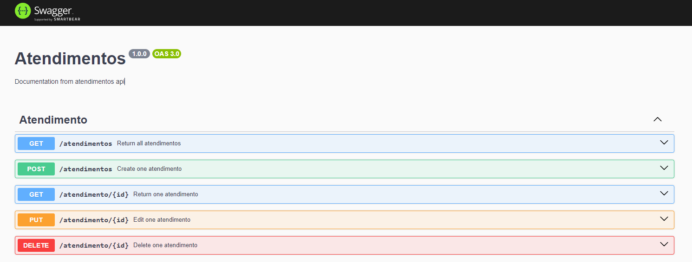

<h3 align="center">
  <p> API REST ATENDIMENTOS </p>
</h3>
<h1>
  
  <p> Documentação Swagger | Endpoints </p>
</h1>

## 📖 Sobre o projeto

- Criação de uma **api rest** para gerenciamento de atendimentos.
- Aprendendo sobre a tecnológia Node Express.

## 🔨 Tecnologias utilizadas

- [Javascript](https://developer.mozilla.org/en-US/docs/Web/JavaScript)
- [Node](https://nodejs.org/pt)
- [Express Js](https://expressjs.com/pt-br/)
- [MySql](https://dev.mysql.com/doc/)
- [Git](https://git-scm.com/)
- [Swagger](https://swagger.io/docs/)

## ♻️ Como executar o projeto
### Pré-requisitos: 
  - Node
  - MySql
  - Git

```bash
  # Clonar repositório
  $ git clone https://github.com/jefersoniw/atendimento_nodejs.git
```

```bash
  # Entrar na pasta do projeto
  $ cd atendimento_nodejs
```

```bash
  # Instalar dependências
  $ npm install
```

```bash
  # Executar projeto
  $ nodemon index.js
```
## 🛎️ License

[](https://github.com/jefersoniw/atendimento_nodejs/blob/main/LICENSE)

## 🤓 Autor
### Jeferson Chagas Silva
### https://www.linkedin.com/in/jefersoniw/


